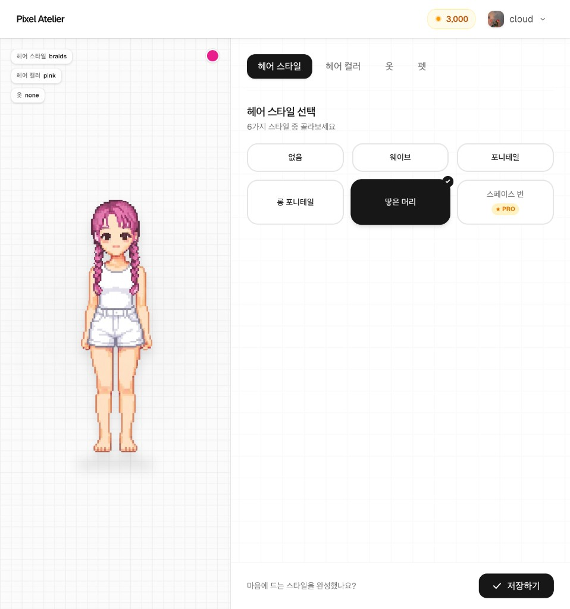

# Pixel Atelier

나만의 픽셀 캐릭터를 만들고, 커스터마이징 요소를 저장해 관리할 수 있는 캐릭터 메이커 서비스입니다.  
Google 로그인으로 바로 시작하고, 크레딧을 사용해 프리미엄 스타일을 이용할 수 있습니다.

## 서비스 개요

`Pixel Atelier`는 "내 캐릭터를 내 취향대로"라는 목표에 맞춘 웹 기반 픽셀 아바타 제작 서비스입니다.

- 헤어 스타일, 헤어 컬러, 의상, 펫 등 카테고리별 커스터마이징
- 커스터마이징 결과를 사용자 계정에 저장
- 크레딧 기반 프리미엄 옵션 이용
- 결제 완료 시 웹훅으로 크레딧 자동 적립

## 서비스 화면



### 사용자 흐름

1. 랜딩 페이지에서 서비스 소개 확인
2. Google OAuth 로그인
3. 워크스페이스에서 캐릭터 요소 선택/미리보기
4. 저장 버튼으로 캐릭터 설정 반영
5. 크레딧이 필요하면 결제 후 자동 적립

## 기획 의도 및 구현 범위

**디자인부터 인증/데이터/결제/배포까지 제품 개발 전 과정을 스스로 연결하는 경험**을 하기 위해 시작한 프로젝트입니다.

- UI/UX 설계와 인터랙션 구현
- 인증/권한 처리와 상태 관리
- 데이터 모델링과 DB 연동
- 결제 플로우와 웹훅 처리
- 운영을 고려한 배포 및 환경변수 관리

실제 서비스 관점에서 "사용자 행동 -> 데이터 변경 -> 결제 이벤트 -> 후속 처리"가 하나의 흐름으로 동작하도록 만드는 데 집중했습니다.

- **Design**: 픽셀 아트 톤의 브랜드/화면 구조 설계, 워크스페이스 UX 구성
- **Frontend**: Next.js 기반 랜딩/로그인/커스터마이징 UI 및 실시간 미리보기 구현
- **Backend**: 서버 액션 기반 저장/크레딧 로직, 권한 체크, API 라우트 구성
- **Database**: Supabase 테이블 연동, 사용자 크레딧/커스터마이징 상태 관리
- **Payment**: Polar 체크아웃 생성, 웹훅 검증 후 결제 완료 데이터 반영
- **Deployment Ready**: 환경변수 분리, 운영을 고려한 실행/구성 문서화

## 개발 정보

### 기술 스택

- `Next.js 16` (App Router), `React 19`, `TypeScript`
- `Tailwind CSS 4`, `Framer Motion`
- `Supabase` (Auth, Database), `Polar` (체크아웃/웹훅)

### 프로젝트 구조

| 경로          | 설명                            |
| ------------- | ------------------------------- |
| `app/`        | 라우트, 서버 액션, API 라우트   |
| `components/` | UI 및 워크스페이스 컴포넌트     |
| `contexts/`   | 전역 상태 컨텍스트              |
| `lib/`        | Supabase 클라이언트 및 유틸리티 |

### 실행 방법

```bash
npm install
npm run dev
```

- 기본 실행 주소: `http://localhost:3000`

#### 실행 스크립트

| 명령어          | 설명               |
| --------------- | ------------------ |
| `npm run dev`   | 개발 서버 실행     |
| `npm run build` | 프로덕션 빌드      |
| `npm run start` | 프로덕션 서버 실행 |
| `npm run lint`  | ESLint 실행        |

### 환경 변수

프로젝트 루트에 `.env.local` 파일을 만들고 아래 값을 설정하세요.

```env
NEXT_PUBLIC_SUPABASE_URL=
NEXT_PUBLIC_SUPABASE_ANON_KEY=
SUPABASE_SERVICE_ROLE_KEY=

POLAR_API_TOKEN=
POLAR_SERVER=sandbox
POLAR_WEBHOOK_SECRET=
POLAR_BASIC_PRODUCT_ID=
POLAR_PLUS_PRODUCT_ID=
POLAR_PRO_PRODUCT_ID=
```

## 참고

현재 결제/크레딧 로직은 Supabase 스키마 및 RPC(예: `record_payment`)와 연결되어 있으므로, 로컬에서 동일 스키마를 준비해야 전체 플로우를 확인할 수 있습니다.
